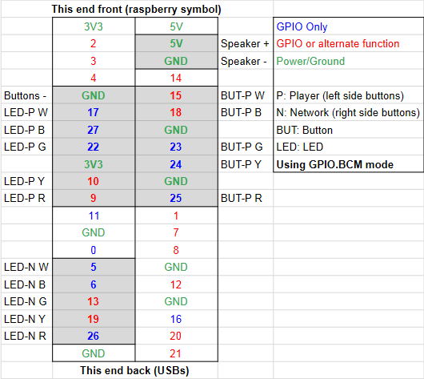
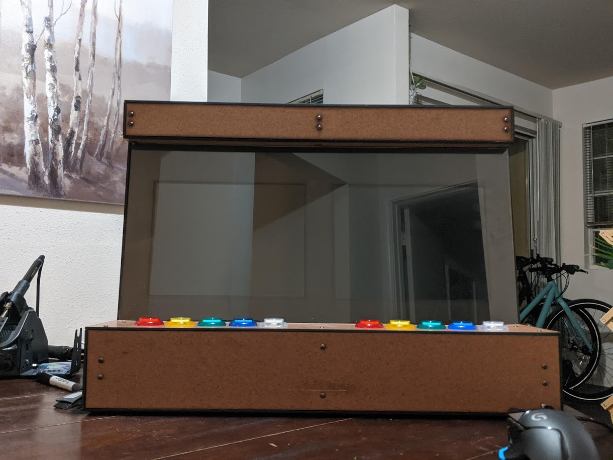
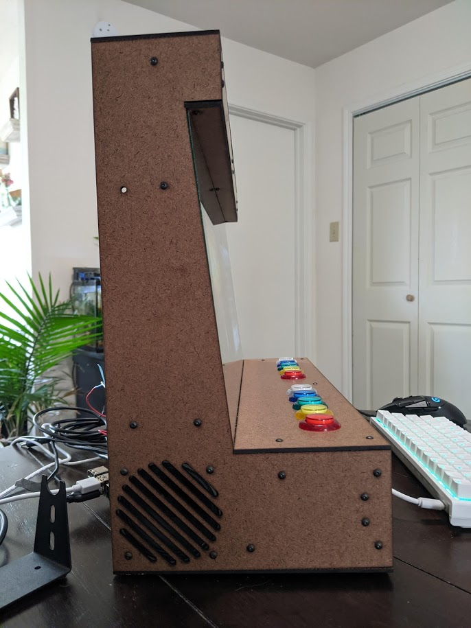
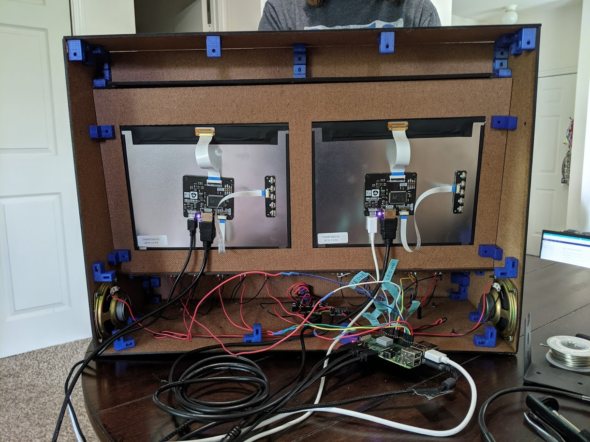

# Firmware and Hardware

The code in this folder is a library that essentially connects the software to the hardware on the Rapsberry pi. This code is intended to be run on a Raspberry Pi 4, but can be adapted for other models, or for other hardware.

This part of the readme will also describe the physical hardware setup and connections.


## Files

The files in this folder are as follows:

 1. `button_func.py` holds functions to be called by `../app_env/game_vis.py` that read button presses on the arcade machine, or send signals to turn an LED on or off.
 2. `launcher.sh` is intended to launch `../app_env/game_vis.py` from the desktop. It is a script that simply changes directory to the correct location and runs `game_vis.py`.
 3. `test_buttons.py` is a tester function meant to test one button press or LED individually. It works by calling functions from `button_func.py` to test them individually. Which button you're testing can be changed by simply changing the button that is being referenced.

### Button Func
#### Naming scheme
The following naming scheme is used to reference pinouts throughout the button_func file, and on the hardware itself.

 - LED refers to the light-up portion of the button; BUT refers to the
   button press portion of the buttons.
  - "P" refers to "player" and "N" refers to network.
  - W, B, G, Y, R refer to the colors white, blue, green, yellow, red, respectively.

Example: `LED_P_R` refers to the red player LED.

#### Header variables
The first list of variables are constants referring to pins. 

The variable `lastpinval` is used to handle debouncing. See the `read_buttons` function for more information.

#### Functions

`button_func.py` has several functions:
1. `setup` should be called at the beginning of any code referencing this libary. Initializes pins and the GPIO mode. For this project, we are using `GPIO.BCM` naming scheme.
2. `read_button` takes no arguments, returns an array of true/false values determining which of the 5 player buttons, if any, have been pressed. Also handles debouncing of the button signal as a rising edge.
3. `flash_led` takes a pin value and a boolean. It will set the value of the given pin to low/high with a boolean of false/true respectively. This is intended to be used with a counter to flash the LED for the correct amount of time, without the use of threads or delaying the system. See the game documentation for more information.
4. `cleanup` should be called at the end of any code referencing this library. It breaks down and frees up use of the GPIO pins.
5. Commented code at the bottom is another method of testing. 

### Launcher
This shell script is intended to be placed on the desktop of the Raspberry Pi. It should then cd to the directory where the game is located, and run the game. To set up this script to use the correct path based on your implementation, you can simply change "SeniorDesign" in the path to your path to the repository.
```
cd ../SeniorDesign/app_env
python3 game_vis.py
```
### Test Buttons
This python program can be ran as follows:
```
python3 test_buttons.py [button|led]
```
Argument "button" or "led" specifies whether function "read button" or "flash led" is being tested. This program simply calls functions from button func, and outputs the result.

## Connection to the Pi
### Pinouts
For this project, we used the RPi GPIO library. We are using the BCM naming scheme. The pin numbers are as follows:


The pinout as used for the arcade machine is as follows:



## Hardware

### Housing

The following photos illustrate the housing:





The lefthand screen is meant to display the game. The righthand screen is meant to display the neural network visualizer.

The lefthand buttons are the player buttons, which activate when pressed. The righthand buttons are the neural network buttons which only the LEDs are used and are activated as the network plays the game.

### Wiring diagram


## Future Work

This section outlines potential future work to improve the firmware and hardware of this project.

### Firmware Improvements
 
1. Update button read function to use interrupts. [This website](https://raspberrypi.stackexchange.com/questions/76667/debouncing-buttons-with-rpi-gpio-too-many-events-detected) outlines a potential solution.
2. Update led flashes to utilize threads, thus removing the counter functionality (in the game vis code). [This website](https://www.geeksforgeeks.org/creating-child-process-using-fork-python/) gives a tutorial on a potential way to accomplish this.

### Hardware and Housing Improvements

1. Power monitors and pi through the power rail. Use single power supply cable to power all items. 
	- Will need power-only (non shielded ground) USB cables to power the monitors.
	- Will need to adjust the back of the housing to accomodate the proper size cable.
2. Wire speakers to female-end connectors to connect to the Pi.
3. Alter how the back cover is connected to the rest of the housing, so it is easier to take on and off.
